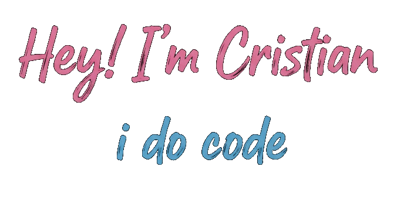

### 📔 About me
**`technology enthusiast / knowledge digger`**

I'm currently studying Science and Technology. I really love technology and computer programming, I'm currently working on personal projects that help me to understand more about it. Yet, most of my code sessions are correlated with themes that I like too, like:  games, historical concepts and movies. You can check more of it on my [personal website!](https://cristianism0.github.io)

---
### ✏️ Languages and Tools

          

          

  

<!---
---

### 📊 Stats

-->

---

  
<h3>🧸A little bit more of me.</h3>

I started coding in high school, where I was introduced to basic IT and static site creation using HTML and CSS. I also studied other fields of IT, like networking (my favorite!) and a bit of Java. Currently, I am studying Science and Technology with the goal of moving into Computer Science in the future.

  In my free time, I usually spend my days reading, studying, or coding projects to build a more robust understanding of language syntax and logic. I also enjoy writing about philosophy and historical or sociological topics on my blog. I often write about Linux too, which is a system I love.

---
###### Brief view of Tux:

